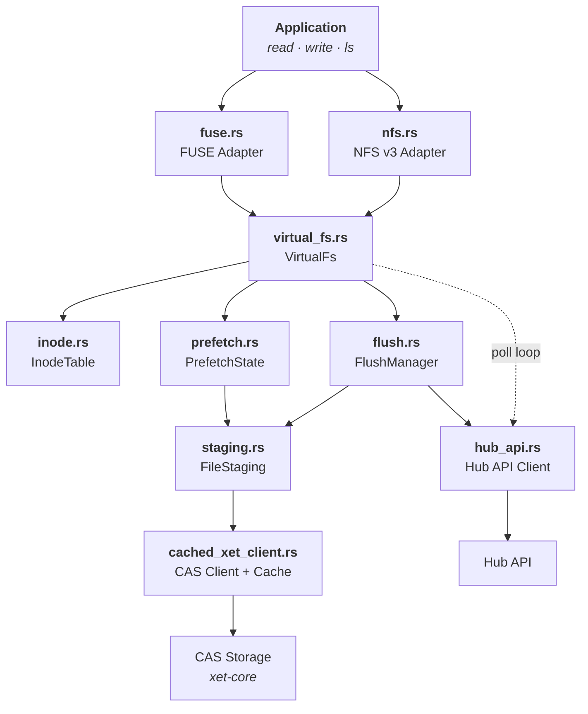
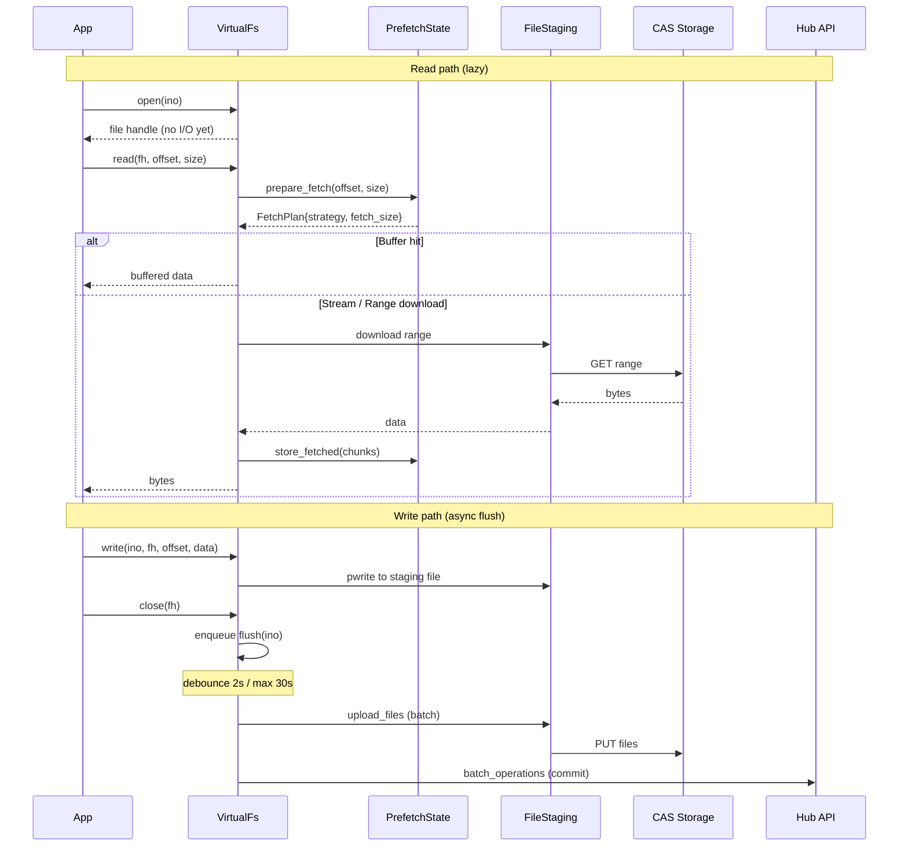

# hf-mount

Mount [Hugging Face Buckets](https://huggingface.co/docs/hub/buckets) as a local filesystem using FUSE or NFS.

## Features

- **FUSE & NFS backends** — FUSE for standard Linux/macOS, NFS for environments without `/dev/fuse` (e.g., Kubernetes CSI)
- **Adaptive prefetch** — 8 MB initial window, grows up to 128 MB for sequential reads
- **Lazy loading** — files are fetched on demand from CAS, not eagerly downloaded
- **Read-write support** — create, write, rename, delete files; changes are batched and uploaded asynchronously
- **Debounced flush** — writes are coalesced (2s debounce, 30s max window) into a single CAS upload + Hub API call
- **Remote sync** — background polling detects remote changes and updates the local view
- **Read-only mode** — `--read-only` flag for safe, read-only mounts

## Architecture



### Data flow



## Installation

### Prerequisites

- Rust 1.80+
- FUSE: `libfuse-dev` (Linux) or `macFUSE` (macOS)
- NFS: no extra dependency

### Build

```bash
# FUSE backend only (default)
cargo build --release

# FUSE + NFS backends
cargo build --release --features nfs
```

The binary is at `target/release/hf-mount`.

## Usage

```bash
hf-mount \
  --bucket-id <USER/BUCKET> \
  --mount-point <PATH> \
  --hf-token <TOKEN>
```

### Options

| Flag | Default | Description |
|------|---------|-------------|
| `--bucket-id` | *required* | Hugging Face bucket ID (e.g. `myuser/mybucket`) |
| `--mount-point` | *required* | Local directory to mount on |
| `--hf-token` | *required* | HF API token (or `HF_TOKEN` env var) |
| `--hub-endpoint` | `https://huggingface.co` | Hub API endpoint |
| `--cache-dir` | `/tmp/hf-mount-cache` | Local cache directory |
| `--cache-size` | `10000000000` | Max size in bytes for the on-disk xorb chunk cache |
| `--backend` | `fuse` | `fuse` or `nfs` (NFS requires `--features nfs`) |
| `--read-only` | `false` | Mount read-only |
| `--poll-interval-secs` | `30` | Remote change polling interval (0 to disable) |
| `--max-threads` | `16` | Maximum number of FUSE threads |
| `--uid` | current user | UID for mounted files |
| `--gid` | current group | GID for mounted files |

### Examples

```bash
# Read-write FUSE mount
hf-mount --bucket-id myuser/data \
         --mount-point /mnt/data \
         --hf-token $HF_TOKEN

# Read-only NFS mount (e.g. in a container without /dev/fuse)
hf-mount --bucket-id myuser/models \
         --mount-point /mnt/models \
         --hf-token $HF_TOKEN \
         --backend nfs \
         --read-only

# Custom cache and polling
hf-mount --bucket-id myuser/data \
         --mount-point /mnt/data \
         --hf-token $HF_TOKEN \
         --cache-dir /var/cache/hf-mount \
         --poll-interval-secs 60
```

### Logging

```bash
RUST_LOG=hf_mount=debug hf-mount ...
```

## Benchmarks

50 MB file, m5.xlarge, us-east-1:

| Metric | FUSE | NFS |
|--------|------|-----|
| Sequential read (cold) | 175 MB/s | 170 MB/s |
| Sequential re-read (cached) | 1.6 GB/s | 1.5 GB/s |
| Range read (1 MB @ 25 MB) | 0.7 ms | 0.4 ms |
| Random reads (100 x 4 KB) | < 0.1 ms | 0.1 ms |

## Testing

```bash
# Unit tests
cargo test

# Integration tests (require HF_TOKEN and network)
HF_TOKEN=... cargo test --release --test fuse_ops
HF_TOKEN=... cargo test --release --test nfs_ops --features nfs

# Benchmarks
HF_TOKEN=... cargo test --release --test bench --features nfs
HF_TOKEN=... cargo test --release --test fio_bench --features nfs
```

## License

Apache-2.0
