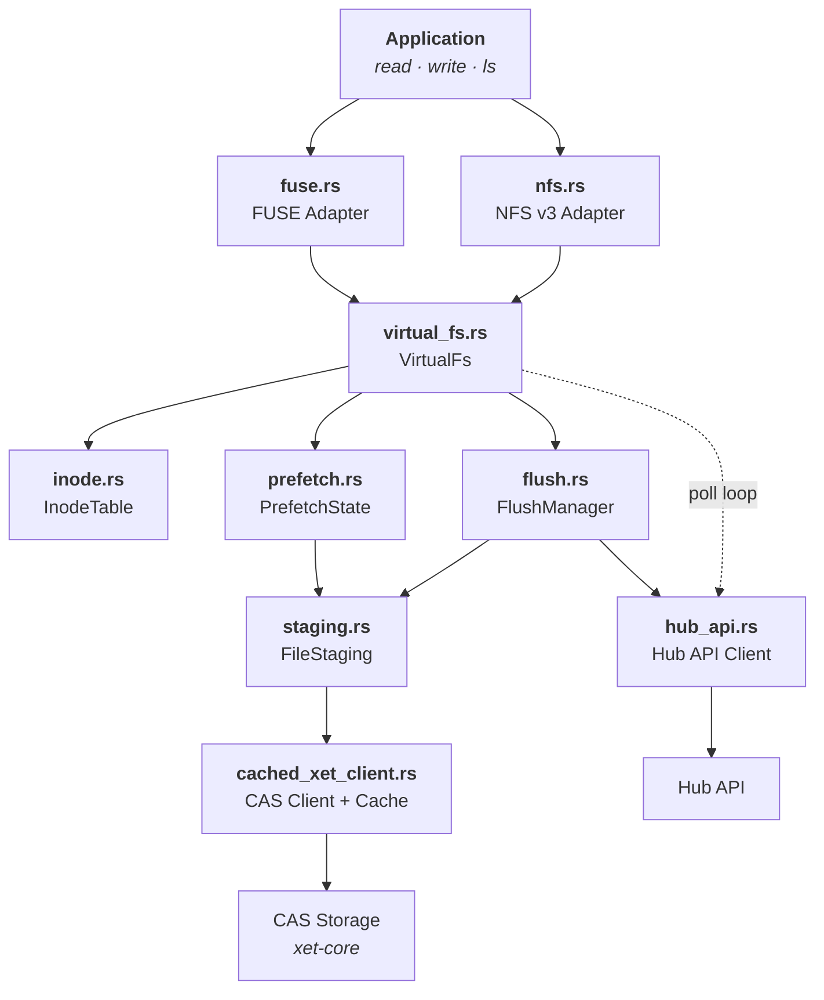
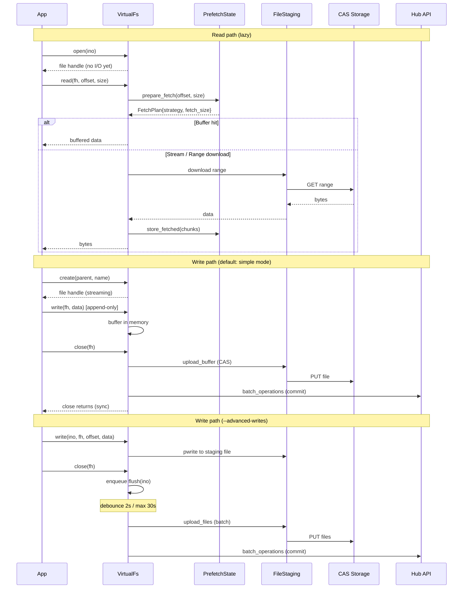

# hf-mount

Mount [Hugging Face Buckets](https://huggingface.co/docs/hub/buckets) and repos as a local filesystem using FUSE or NFS.

## Quick start

```bash
# Install system deps (Ubuntu/Debian)
sudo apt-get install -y fuse3 libfuse3-dev

# Build
cargo build --release

# Mount GPT-2 (public repo, no token needed)
mkdir /tmp/gpt2
./target/release/hf-mount-fuse repo gpt2 /tmp/gpt2

# Browse it
ls /tmp/gpt2
cat /tmp/gpt2/config.json
head -c 256 /tmp/gpt2/model.safetensors | xxd

# Unmount
fusermount -u /tmp/gpt2
```

For private repos or buckets, pass `--hf-token` or set the `HF_TOKEN` env var.

## Features

- **FUSE & NFS backends** -- FUSE for standard Linux/macOS, NFS for environments without `/dev/fuse` (e.g., Kubernetes)
- **Buckets & repos** -- mount buckets (read-write) or model/dataset/space repos (read-only)
- **Repo alias resolution** -- short names like `gpt2` are resolved to their canonical ID (`openai-community/gpt2`)
- **Auto repo type detection** -- `datasets/user/ds` and `spaces/user/app` prefixes are detected automatically, otherwise defaults to model
- **Lazy loading** -- files are fetched on demand from CAS, not eagerly downloaded
- **Adaptive prefetch** -- 8 MB initial window, grows up to 128 MB for sequential reads
- **ETag-based caching** -- plain git/LFS files use HTTP conditional requests for efficient cache revalidation
- **Simple writes** (FUSE default) -- append-only, in-memory streaming to CAS, synchronous upload on close
- **Advanced writes** (`--advanced-writes`, always-on for NFS) -- staging files on disk, random writes + seek, async debounced flush
- **Remote sync** -- background polling detects remote changes and updates the local view
- **Read-only mode** -- `--read-only` flag for safe mounts (always on for repos)

## Prerequisites

- **Rust** 1.85+ (nightly required for `cargo fmt` only)
- **Linux**: `fuse3` and `libfuse3-dev` (FUSE), `nfs-common` (NFS client for mount)
- **macOS**: [macFUSE](https://osxfuse.github.io/) (FUSE only, NFS not supported)

## Build

```bash
# FUSE only (default)
cargo build --release

# FUSE + NFS
cargo build --release --features nfs
```

Binaries:
- `target/release/hf-mount-fuse`
- `target/release/hf-mount-nfs` (requires `--features nfs`)

## Usage

### Mount a repo (read-only)

```bash
# Public model (no token needed)
hf-mount-fuse repo gpt2 /mnt/gpt2

# Private model
hf-mount-fuse --hf-token $HF_TOKEN repo myorg/my-private-model /mnt/model

# Dataset (auto-detected from prefix)
hf-mount-fuse repo datasets/squad /mnt/squad

# Specific revision
hf-mount-fuse repo openai-community/gpt2 /mnt/gpt2 --revision v1.0
```

### Mount a bucket (read-write)

```bash
hf-mount-fuse --hf-token $HF_TOKEN bucket myuser/my-bucket /mnt/data

# Read-only
hf-mount-fuse --hf-token $HF_TOKEN --read-only bucket myuser/my-bucket /mnt/data
```

### NFS backend

Use `hf-mount-nfs` when `/dev/fuse` is unavailable (e.g., unprivileged containers):

```bash
hf-mount-nfs --hf-token $HF_TOKEN bucket myuser/my-bucket /mnt/data
```

### Unmount

```bash
# FUSE
fusermount -u /mnt/data

# NFS
sudo umount /mnt/data
```

### Options

| Flag | Default | Description |
| --- | --- | --- |
| `--hf-token` | `$HF_TOKEN` | HF API token. Required for private repos/buckets, optional for public repos |
| `--hub-endpoint` | `https://huggingface.co` | Hub API endpoint |
| `--cache-dir` | `/tmp/hf-mount-cache` | Local cache directory |
| `--cache-size` | `10000000000` (~10 GB) | Max on-disk xorb chunk cache size in bytes |
| `--read-only` | `false` | Mount read-only (always on for repos) |
| `--advanced-writes` | `false` | Staging files + async flush (random writes, seek, overwrite) |
| `--poll-interval-secs` | `30` | Remote change polling interval (0 to disable) |
| `--max-threads` | `16` | Maximum FUSE worker threads |
| `--metadata-ttl-ms` | `10000` | Kernel metadata cache TTL in milliseconds |
| `--metadata-ttl-minimal` | `false` | HEAD on every lookup (skip TTL cache) |
| `--uid` / `--gid` | current user | Override UID/GID for mounted files |

### Logging

```bash
RUST_LOG=hf_mount=debug hf-mount-fuse repo gpt2 /mnt/gpt2
```

## Architecture



### Data flow



## Consistency model

hf-mount detects remote file changes through two mechanisms:

1. **HEAD revalidation on lookup** (FUSE only) -- When the kernel metadata TTL expires (default 10 s), the next file access triggers a `HEAD` request on the Hub resolve endpoint. For xet-backed files, changes are detected via `xet_hash`. For plain git/LFS files, changes are detected via size comparison, and ETag-based conditional downloads catch same-size content changes.

2. **Background polling** -- A poll loop (default every 30 s) lists the full tree and detects additions, modifications, and deletions. This catches changes to files that haven't been individually accessed.

### FUSE vs NFS

| Capability | FUSE | NFS |
| --- | --- | --- |
| HEAD revalidation on lookup | Yes (per-file, within TTL) | No (NFS uses file handles, no re-lookup) |
| Background poll | Yes | Yes |
| Page cache invalidation | `notify_inval_inode` | Not supported by NFS protocol |
| Staleness window | ~10 s (metadata TTL) | Up to poll interval (default 30 s) |
| Write mode | Simple (streaming) by default | Advanced (staging files) always |

### Metadata TTL modes

- **Default** (`--metadata-ttl-ms 10000`): HEAD only when the per-inode TTL expires. Best balance of consistency and performance.
- **Minimal** (`--metadata-ttl-minimal`): HEAD on every lookup. Maximum consistency, lower throughput.
- **Higher TTL** (`--metadata-ttl-ms 60000`): Less frequent HEAD requests. Better re-read performance, slower remote change detection.

## Testing

```bash
# Unit tests (no network, no token)
cargo test --lib

# Integration tests (require HF_TOKEN and FUSE)
HF_TOKEN=... cargo test --release --test fuse_ops -- --test-threads=1 --nocapture
HF_TOKEN=... cargo test --release --test nfs_ops --features nfs -- --test-threads=1 --nocapture

# Repo mount test (public repo, no token needed)
cargo test --release --test repo_ops -- --test-threads=1 --nocapture

# Benchmarks
HF_TOKEN=... cargo test --release --test bench --features nfs -- --nocapture
HF_TOKEN=... cargo test --release --test fio_bench --features nfs -- --nocapture
```

## License

Apache-2.0
