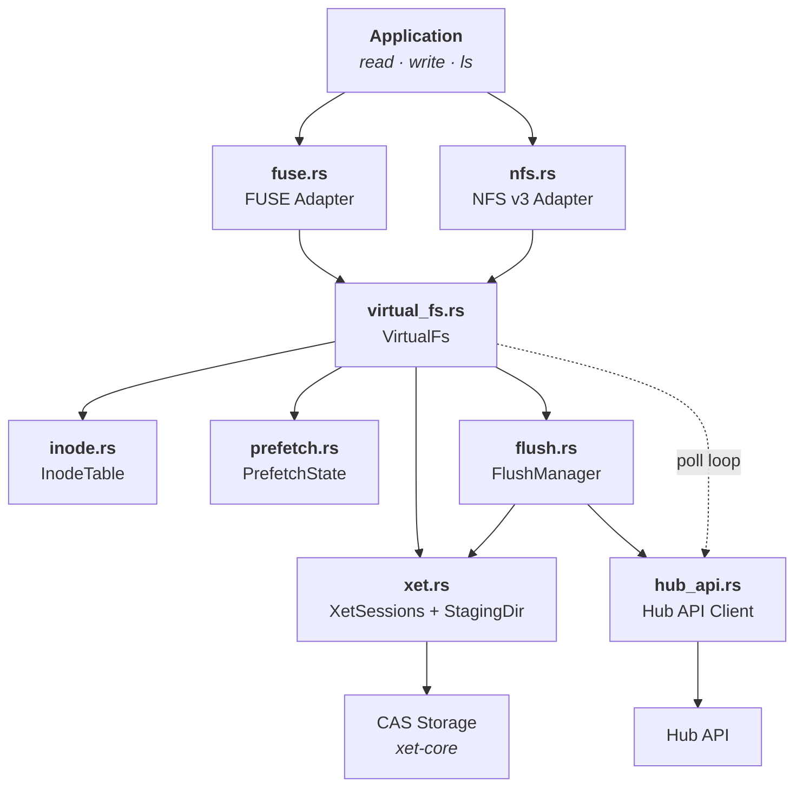
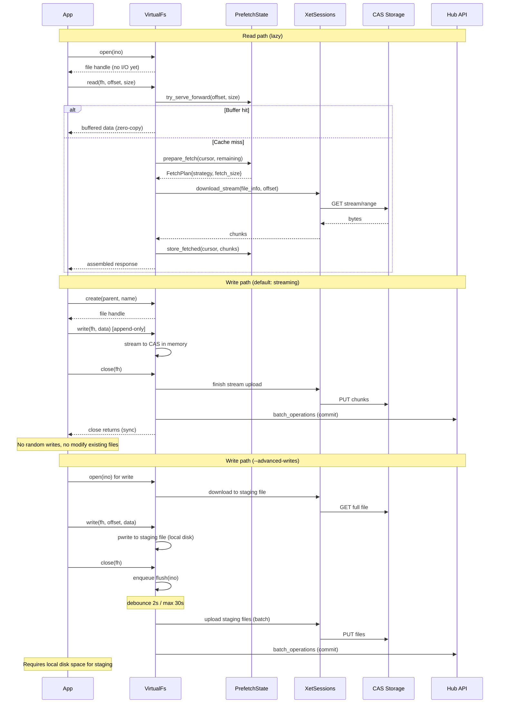

# hf-mount

Mount [Hugging Face Buckets](https://huggingface.co/docs/hub/buckets) and repos as a local filesystem using FUSE or NFS.

## Quick start

### FUSE

**Linux (Ubuntu/Debian)**

```bash
sudo apt-get install -y fuse3 libfuse3-dev
cargo build --release
```

**macOS** (requires [macFUSE](https://osxfuse.github.io/))

```bash
brew install macfuse
cargo build --release
```

**Mount GPT-2** (public repo, no token needed)

```bash
mkdir /tmp/gpt2
./target/release/hf-mount-fuse repo gpt2 /tmp/gpt2
ls /tmp/gpt2
```

### NFS

Use NFS when `/dev/fuse` is unavailable (e.g., unprivileged Kubernetes containers):

```bash
cargo build --release

mkdir /tmp/gpt2
./target/release/hf-mount-nfs repo gpt2 /tmp/gpt2
ls /tmp/gpt2
```

### Load a model directly from the mount

No download step -- the model is read on demand from CAS:

```python
from transformers import AutoModelForCausalLM, AutoTokenizer

tokenizer = AutoTokenizer.from_pretrained("/tmp/gpt2")
model = AutoModelForCausalLM.from_pretrained("/tmp/gpt2")

inputs = tokenizer("The future of AI is", return_tensors="pt")
tokens = model.generate(**inputs, max_new_tokens=50)
print(tokenizer.decode(tokens[0], skip_special_tokens=True))
```

```bash
# Unmount
fusermount -u /tmp/gpt2   # FUSE (Linux)
umount /tmp/gpt2           # FUSE (macOS) or NFS
```

For private repos or buckets, pass `--hf-token` or set the `HF_TOKEN` env var.

## Features

- **FUSE & NFS backends** -- FUSE for standard Linux/macOS, NFS for environments without `/dev/fuse` (e.g., Kubernetes)
- **Buckets & repos** -- mount buckets (read-write) or model/dataset/space repos (read-only)
- **Lazy loading** -- files are fetched on demand from CAS, not eagerly downloaded
- **Simple writes** (FUSE default) -- append-only, in-memory streaming to CAS, synchronous upload on close
- **Advanced writes** (`--advanced-writes`, always-on for NFS) -- staging files on disk, random writes + seek, async debounced flush
- **POSIX metadata** -- chmod, chown, timestamps, symlinks (ephemeral, see below)
- **Remote sync** -- background polling detects remote changes and updates the local view
- **Read-only mode** -- `--read-only` flag for safe mounts (always on for repos)

### Ephemeral POSIX metadata

File permissions, ownership (uid/gid), timestamps (atime/ctime), and symlinks are supported
in-memory. Hard links are not supported (returns ENOTSUP). This allows tools that expect a
POSIX-like environment (rsync, git, compilers, package managers) to work correctly on the
mounted filesystem.

**This metadata is ephemeral**: it is not persisted to remote storage and is lost on
unmount/remount. Only file content and directory structure are stored remotely.

## Prerequisites

- **Rust** 1.85+ (nightly required for `cargo fmt` only)
- **Linux**: `fuse3` and `libfuse3-dev` (FUSE), `nfs-common` (NFS client for mount)
- **macOS**: [macFUSE](https://osxfuse.github.io/) (FUSE), NFS client built-in

## Build

```bash
cargo build --release
```

Binaries:
- `target/release/hf-mount-fuse`
- `target/release/hf-mount-nfs`

## Usage

### Mount a repo (read-only)

```bash
# Public model (no token needed)
hf-mount-fuse repo gpt2 /mnt/gpt2

# Private model
hf-mount-fuse --hf-token $HF_TOKEN repo myorg/my-private-model /mnt/model

# Dataset (auto-detected from prefix)
hf-mount-fuse repo datasets/squad /mnt/squad

# Specific revision
hf-mount-fuse repo openai-community/gpt2 /mnt/gpt2 --revision v1.0
```

### Mount a bucket (read-write)

```bash
hf-mount-fuse --hf-token $HF_TOKEN bucket myuser/my-bucket /mnt/data

# Read-only
hf-mount-fuse --hf-token $HF_TOKEN --read-only bucket myuser/my-bucket /mnt/data
```

### NFS backend

Use `hf-mount-nfs` when `/dev/fuse` is unavailable (e.g., unprivileged containers):

```bash
hf-mount-nfs --hf-token $HF_TOKEN bucket myuser/my-bucket /mnt/data
```

### Unmount

```bash
# FUSE
fusermount -u /mnt/data

# NFS
sudo umount /mnt/data
```

### Options

| Flag | Default | Description |
| --- | --- | --- |
| `--hf-token` | `$HF_TOKEN` | HF API token. Required for private repos/buckets, optional for public repos |
| `--hub-endpoint` | `https://huggingface.co` | Hub API endpoint |
| `--cache-dir` | `/tmp/hf-mount-cache` | Local cache directory |
| `--cache-size` | `10000000000` (~10 GB) | Max on-disk xorb chunk cache size in bytes |
| `--read-only` | `false` | Mount read-only (always on for repos) |
| `--advanced-writes` | `false` | Staging files + async flush (random writes, seek, overwrite) |
| `--poll-interval-secs` | `30` | Remote change polling interval (0 to disable) |
| `--max-threads` | `16` | Maximum FUSE worker threads |
| `--metadata-ttl-ms` | `10000` | Kernel metadata cache TTL in milliseconds |
| `--metadata-ttl-minimal` | `false` | HEAD on every lookup (skip TTL cache) |
| `--flush-debounce-ms` | `2000` | Advanced writes only. Flush debounce delay (ms) |
| `--flush-max-batch-window-ms` | `30000` | Advanced writes only. Max flush batch window (ms) |
| `--no-disk-cache` | `false` | Disable xorb chunk cache (every read fetches from CAS) |
| `--no-filter-os-files` | `false` | Disable filtering of OS junk files (.DS_Store, Thumbs.db, etc.) |
| `--uid` / `--gid` | current user | Override UID/GID for mounted files |

### Logging

```bash
RUST_LOG=hf_mount=debug hf-mount-fuse repo gpt2 /mnt/gpt2
```

## Architecture



### Data flow



## Consistency model

hf-mount provides **eventual consistency** with remote changes. Files may be stale for up to the metadata TTL (default 10 s) between a remote update and a local read returning the new content.

### Read consistency

Reads are served from an in-memory prefetch buffer. When the buffer misses, data is fetched from CAS on demand. Remote file changes are detected through two mechanisms:

1. **HEAD revalidation on lookup** (FUSE only) -- When the kernel metadata TTL expires (default 10 s), the next file access triggers a `HEAD` request on the Hub resolve endpoint. If the file changed, the page cache is invalidated and subsequent reads fetch the new content. **This means a file can be stale for up to `--metadata-ttl-ms` after a remote update.**

2. **Background polling** -- A poll loop (default every 30 s) lists the full tree and detects additions, modifications, and deletions. This catches changes to files that haven't been individually accessed.

Between TTL expiry and the next HEAD check, reads return the previously cached version. There is no push notification from the Hub, so all consistency relies on client-side polling.

### Write modes

| | Streaming (default) | Advanced (`--advanced-writes`) |
| --- | --- | --- |
| Write pattern | Append-only (sequential) | Random writes, seek, overwrite |
| Storage | In-memory buffer | Local staging file on disk |
| Modify existing files | Overwrite only (O_TRUNC) | Yes (downloads file first) |
| Flush | Synchronous on close | Async, debounced (2 s / 30 s max) |
| Disk space needed | None | Full file size per open file |

**Streaming mode** buffers writes in memory and uploads to CAS on `close()`. Supports new file creation and overwriting existing files (via `O_TRUNC`). Random writes and partial modifications are not supported.

**Advanced mode** downloads the full file to a local staging directory before allowing edits. This requires enough local disk space to hold all concurrently open files. After `close()`, dirty files are flushed asynchronously (debounce 2 s, max batch window 30 s) -- uploaded to CAS then committed via the Hub API. Coming soon: sparse downloads to avoid fetching the full file for small edits.

### FUSE vs NFS

| Capability | FUSE | NFS |
| --- | --- | --- |
| HEAD revalidation on lookup | Yes (per-file, within TTL) | No (NFS uses file handles, no re-lookup) |
| Background poll | Yes | Yes |
| Page cache invalidation | `notify_inval_inode` | Not supported by NFS protocol |
| Staleness window | ~10 s (metadata TTL) | Up to poll interval (default 30 s) |
| Write mode | Simple (streaming) by default | Advanced (staging files) always |

### Metadata TTL modes

- **Default** (`--metadata-ttl-ms 10000`): HEAD only when the per-inode TTL expires. Best balance of consistency and performance.
- **Minimal** (`--metadata-ttl-minimal`): HEAD on every lookup. Maximum consistency, lower throughput.
- **Higher TTL** (`--metadata-ttl-ms 60000`): Less frequent HEAD requests. Better re-read performance, slower remote change detection.

## Testing

```bash
# Unit tests (no network, no token)
cargo test --lib

# Integration tests (require HF_TOKEN and FUSE)
HF_TOKEN=... cargo test --release --test fuse_ops -- --test-threads=1 --nocapture
HF_TOKEN=... cargo test --release --test nfs_ops -- --test-threads=1 --nocapture

# Repo mount test (public repo, no token needed)
cargo test --release --test repo_ops -- --test-threads=1 --nocapture

# Benchmarks
HF_TOKEN=... cargo test --release --test bench -- --nocapture
HF_TOKEN=... cargo test --release --test fio_bench -- --nocapture
```

## License

Apache-2.0
