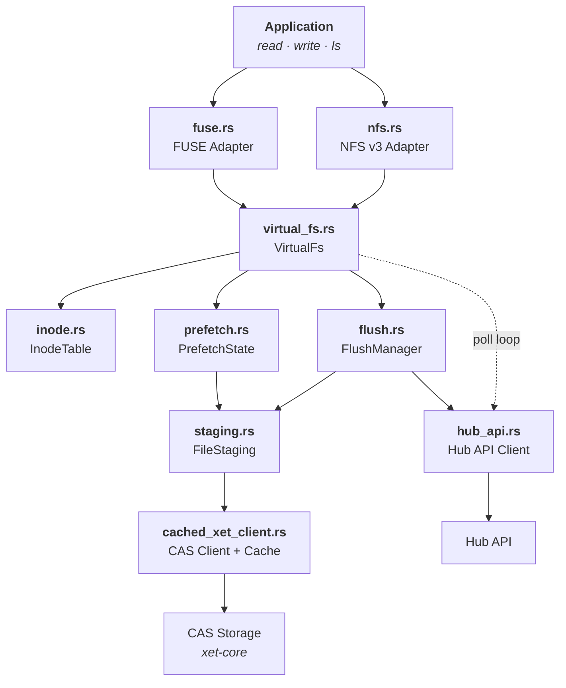
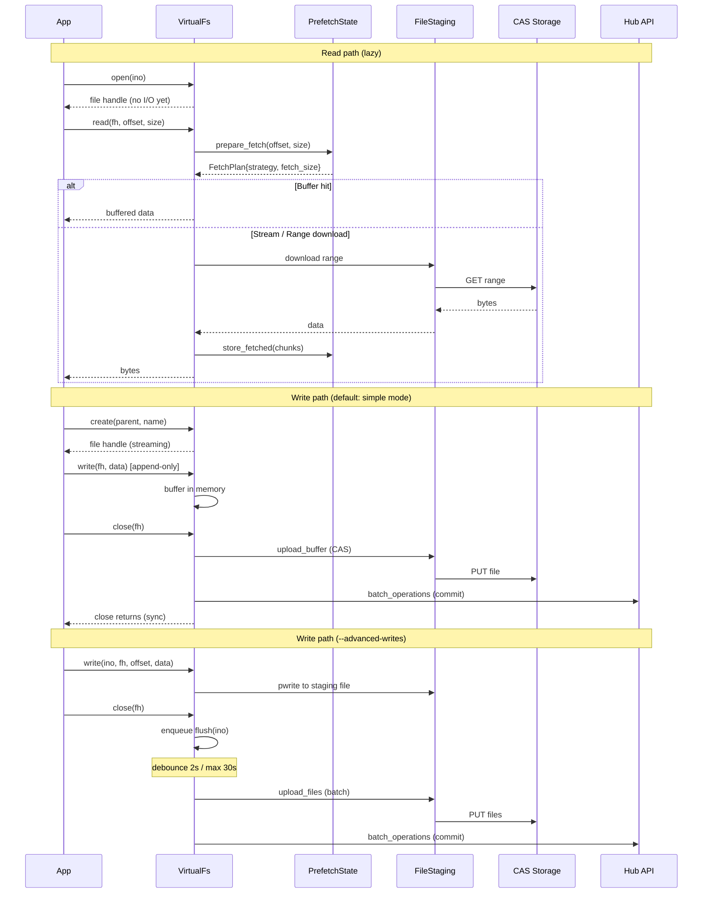

# hf-mount

Mount [Hugging Face Buckets](https://huggingface.co/docs/hub/buckets) as a local filesystem using FUSE or NFS.

## Features

- **FUSE & NFS backends** — FUSE for standard Linux/macOS, NFS for environments without `/dev/fuse` (e.g., Kubernetes CSI)
- **Adaptive prefetch** — 8 MB initial window, grows up to 128 MB for sequential reads
- **Lazy loading** — files are fetched on demand from CAS, not eagerly downloaded
- **Simple writes (default)** — append-only, in-memory buffer, synchronous upload on close (S3-like semantics)
- **Advanced writes** (`--advanced-writes`) — staging files on disk, random writes + seek, async debounced flush
- **Remote sync** — background polling detects remote changes and updates the local view
- **Read-only mode** — `--read-only` flag for safe, read-only mounts

## Architecture



### Data flow



## Installation

### Prerequisites

- Rust 1.80+
- FUSE: `libfuse-dev` (Linux) or `macFUSE` (macOS)
- NFS: no extra dependency

### Build

```bash
# FUSE backend only (default)
cargo build --release

# FUSE + NFS backends
cargo build --release --features nfs
```

The binary is at `target/release/hf-mount`.

## Usage

```bash
hf-mount \
  --bucket-id <USER/BUCKET> \
  --mount-point <PATH> \
  --hf-token <TOKEN>
```

### Options

| Flag                     | Default                  | Description                                                           |
| ------------------------ | ------------------------ | --------------------------------------------------------------------- |
| `--bucket-id`            | _required_               | Hugging Face bucket ID (e.g. `myuser/mybucket`)                       |
| `--mount-point`          | _required_               | Local directory to mount on                                           |
| `--hf-token`             | _required_               | HF API token (or `HF_TOKEN` env var)                                  |
| `--hub-endpoint`         | `https://huggingface.co` | Hub API endpoint                                                      |
| `--cache-dir`            | `/tmp/hf-mount-cache`    | Local cache directory                                                 |
| `--cache-size`           | `10000000000`            | Max size in bytes for the on-disk xorb chunk cache                    |
| `--backend`              | `fuse`                   | `fuse` or `nfs` (NFS requires `--features nfs`)                       |
| `--read-only`            | `false`                  | Mount read-only                                                       |
| `--advanced-writes`      | `false`                  | Staging files + async flush (supports random writes, seek, overwrite) |
| `--poll-interval-secs`   | `30`                     | Remote change polling interval (0 to disable)                         |
| `--max-threads`          | `16`                     | Maximum number of FUSE threads                                        |
| `--metadata-ttl-ms`      | `100`                    | Kernel metadata cache TTL in milliseconds                             |
| `--metadata-ttl-minimal` | `false`                  | Always HEAD on every lookup                                           |
| `--uid`                  | current user             | UID for mounted files                                                 |
| `--gid`                  | current group            | GID for mounted files                                                 |

### Examples

```bash
# Read-write FUSE mount
hf-mount --bucket-id myuser/data \
         --mount-point /mnt/data \
         --hf-token $HF_TOKEN

# Read-only NFS mount (e.g. in a container without /dev/fuse)
hf-mount --bucket-id myuser/models \
         --mount-point /mnt/models \
         --hf-token $HF_TOKEN \
         --backend nfs \
         --read-only

# Custom cache and polling
hf-mount --bucket-id myuser/data \
         --mount-point /mnt/data \
         --hf-token $HF_TOKEN \
         --cache-dir /var/cache/hf-mount \
         --poll-interval-secs 60
```

### Logging

```bash
RUST_LOG=hf_mount=debug hf-mount ...
```

## Consistency model

hf-mount detects remote file changes through two mechanisms:

1. **HEAD revalidation on lookup** (FUSE only) — When the kernel metadata TTL expires (default 100 ms), the next file access triggers a `HEAD` request on the Hub resolve endpoint. If the `xet_hash` changed, the kernel page cache is invalidated and subsequent reads return fresh content.

2. **Background polling** — A poll loop (default every 30 s) lists the full tree and detects additions, modifications, and deletions. This catches changes to files that haven't been individually accessed.

### FUSE vs NFS consistency

| Capability                  | FUSE                          | NFS                                      |
| --------------------------- | ----------------------------- | ---------------------------------------- |
| HEAD revalidation on lookup | Yes (per-file, within 100 ms) | No (NFS uses file handles, no re-lookup) |
| Background poll             | Yes                           | Yes                                      |
| Page cache invalidation     | `notify_inval_inode`          | Not supported by NFS protocol            |
| Staleness window            | ~100 ms (metadata TTL)        | Up to poll interval (default 30 s)       |

FUSE is more consistent: it detects per-file remote changes within the metadata TTL window via HEAD, while NFS relies solely on the poll loop. For latency-sensitive workloads where consistency matters, prefer FUSE.

### Metadata TTL modes

- **Default** (`--metadata-ttl-ms 100`): HEAD only when the per-inode TTL expires. Lookups within the window serve from cache. Best balance of consistency and performance.
- **Minimal** (`--metadata-ttl-minimal`): HEAD on every lookup. Maximum consistency, lower re-read throughput (~300 MB/s vs ~2 GB/s cached).
- **Higher TTL** (`--metadata-ttl-ms 5000`): Less frequent HEAD requests. Better re-read performance, but remote changes take longer to appear.

## Benchmarks

50 MB file, m5.xlarge, us-east-1:

| Metric                    | hf-mount FUSE | hf-mount NFS | mountpoint-s3 |
| ------------------------- | ------------- | ------------ | ------------- |
| Sequential read (cold)    | 221 MB/s      | 220 MB/s     | 104 MB/s      |
| Sequential re-read (warm) | 284 MB/s      | 2.1 GB/s     | 141 MB/s      |
| Range read (1 MB @ 25 MB) | 0.5 ms        | 0.2 ms       | 27 ms         |
| Random reads (100 x 4 KB) | < 0.1 ms      | < 0.1 ms     | 30 ms         |

FUSE re-read includes one HEAD round-trip (~170 ms) per metadata TTL expiry. NFS re-reads are pure kernel page cache (no re-lookup). mountpoint-s3 uses `--metadata-ttl minimal` (its default), which does `HeadObject` on every lookup.

## Testing

```bash
# Unit tests
cargo test

# Integration tests (require HF_TOKEN and network)
HF_TOKEN=... cargo test --release --test fuse_ops  # both simple + advanced write modes
HF_TOKEN=... cargo test --release --test nfs_ops --features nfs

# Benchmarks
HF_TOKEN=... cargo test --release --test bench --features nfs
HF_TOKEN=... cargo test --release --test fio_bench --features nfs
```

## License

Apache-2.0
